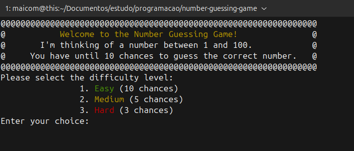
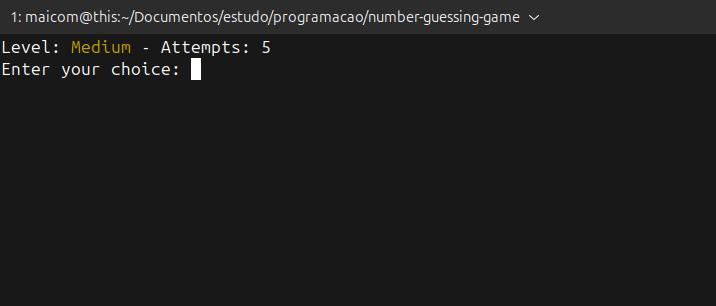
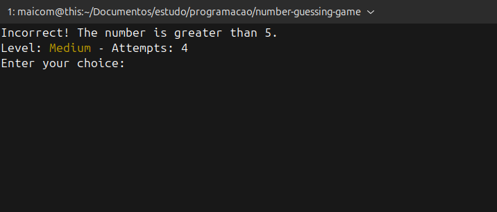
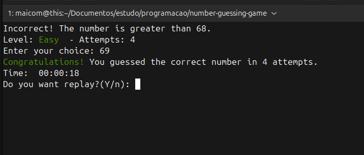
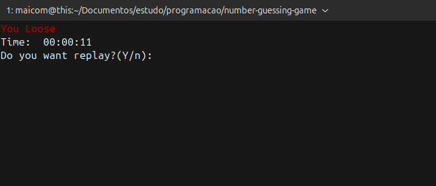

#  Number Guessing Game 

A project made for https://roadmap.sh/projects/number-guessing-game

**Demand:**
"You are required to build a simple number guessing game where the computer randomly selects a number and the user has to guess it. The user will be given a limited number of chances to guess the number. If the user guesses the number correctly, the game will end, and the user will win. Otherwise, the game will continue until the user runs out of chances."

### Usage:

```
    $ number-guessing-game
```

### Starting game

### Playing

### Playing selecting wrong option

### Win 


### Loose 


### Install:

_From deb:_
```
wget https://github.com/maicomferre/-Log-Archive-Tool/releases/download/0.0.1/logs-archive_0.0.1-1_amd64.deb

sudo apt install ./log-archive-tool

number-guessing-game

```

_From source:_
```
wget https://github.com/maicomferre/number-guessing-game/releases/latest

$ ./number-guessing-game.sh

```